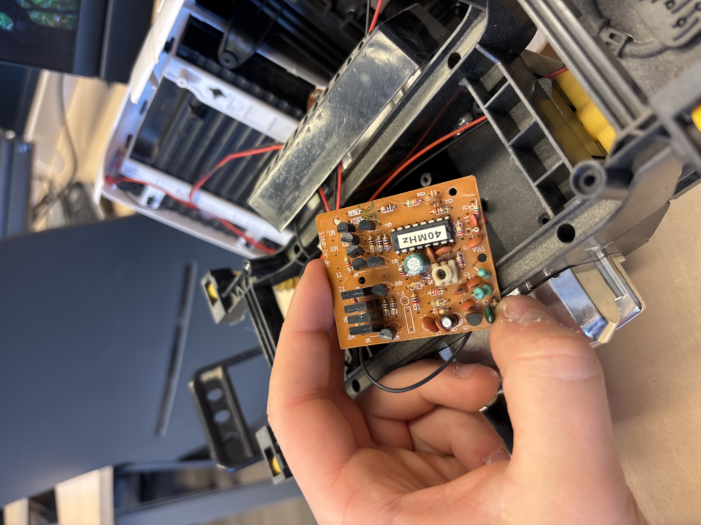
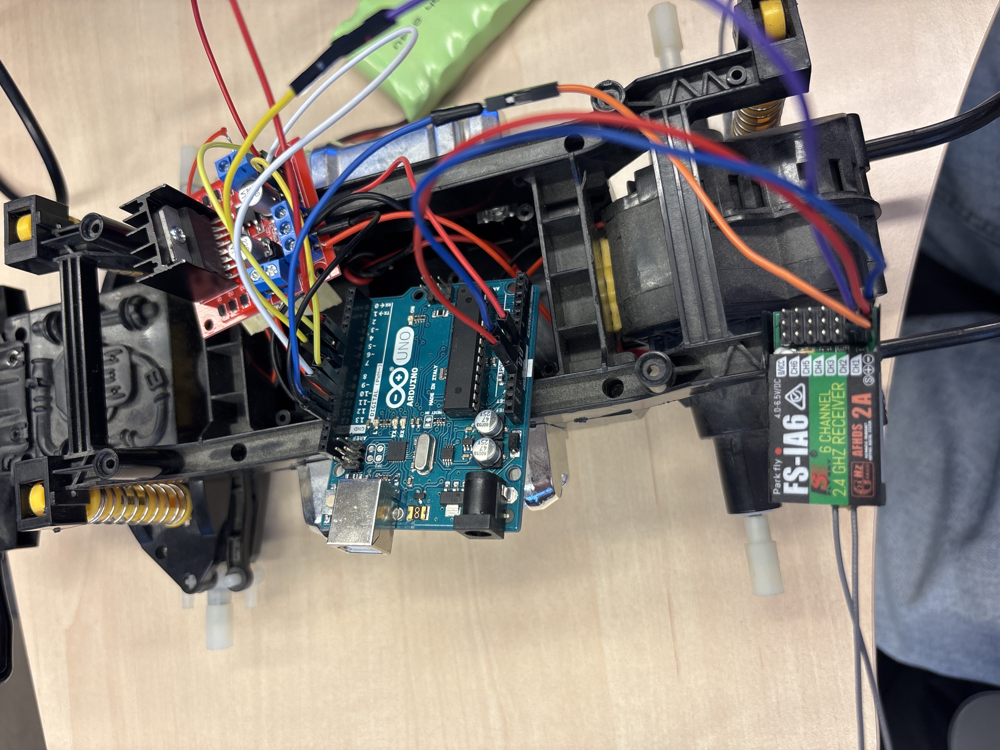

# Kodustvõetud chevy z71 4x4 puldi auto 

## Projekti eesmärk

Projekti eesmärk oli ehitada kodust võetud Chevy Z71 4x4 puldiauto ümber Arduino-põhiseks robotiks, 

## Projekti ja roboti kirjeldus

Projekt põhineb Chevy Z71 4x4 RC-autol, mille originaalne elektroonika eemaldasin ja asendasin Arduinoga. Auto mootorite liigutamiseks kasutasin  mootoridraiveri ning juhtimine toimus FlySky puldiga

Alguses proovisin kasutada Bluetoothi, kuid ei saanud seda tööle

## Ehituse sammud

Kruvisin auto lahti, et saada ligi juhtmetele ja autoajule

Jootsin  aju küljest juhtmed lahti

Testisin akuga, milline juhe mida teeb, ja märkisin ära sõitmise ning pööramise juhtmed

võtsin mittevajalikud osad küljest ära

Paigaldasin Arduino ning hakkasin ühendama  komponente

Asendasin Bluetoothi FlySky puldi ja FS-iA6 vastuvõtjaga(see oli pärast)

## Kasutatud komponendid

Arduino Uno

Mootoridraiver 

Chevy Z71 4x4 RC-auto alus ja mootorid

FlySky pult

FS-iA6 vastuvõtja

Aku

Juhtmed

## Probleemid ja ebaõnnestumised

Bluetoothi ühendust oli raske saada

Bluetoothi käskude vastuvõtmine

Mootorite õigesti tööle saamine

Alguses oli vale aku mis ei toinud piisavalt

## Kokkuvõte

Õppisin kuidas RC-autot lahti võta ja asendada selle aju arduinoga

Arduino kasutamist ja ühendamist

Mootoridraiveri ühendamist

vastuvõtja ühendamist Flysky puldiga

<h3>Pildid</h3>

  
  
  

